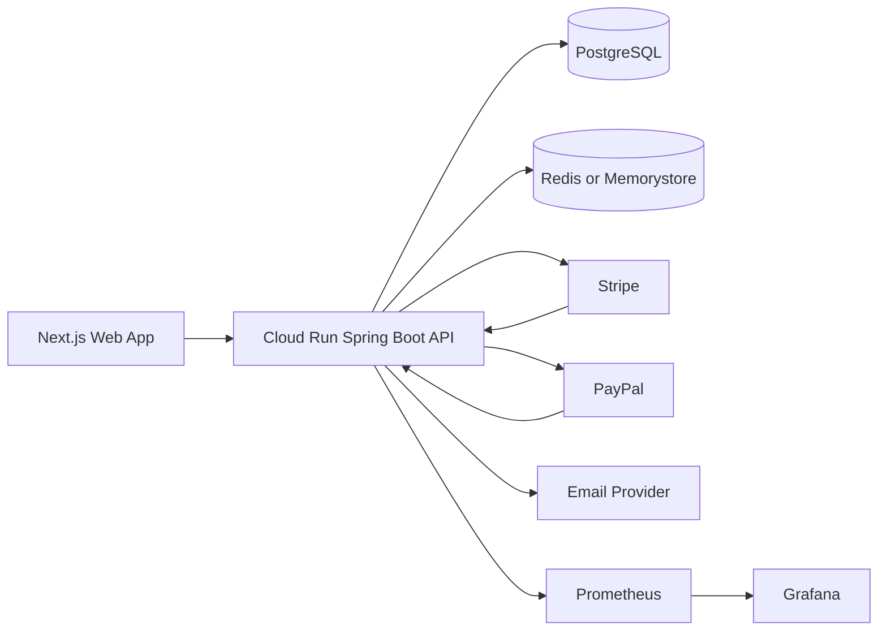
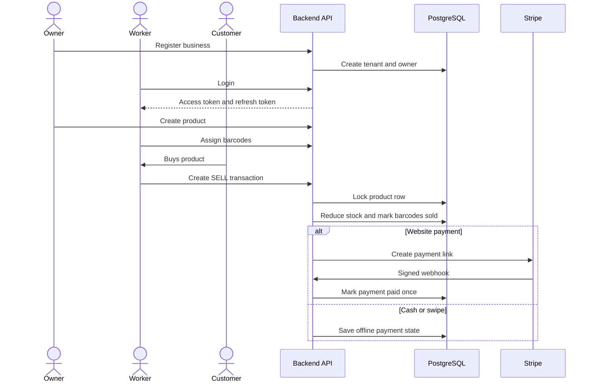
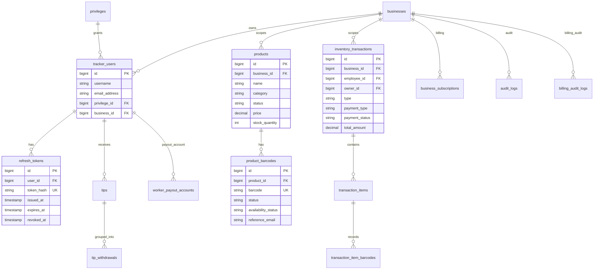
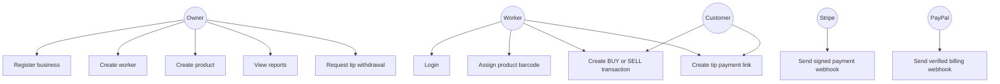
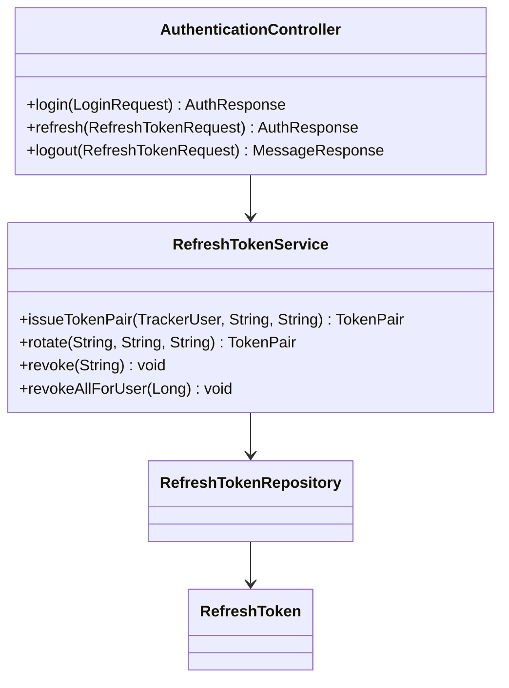
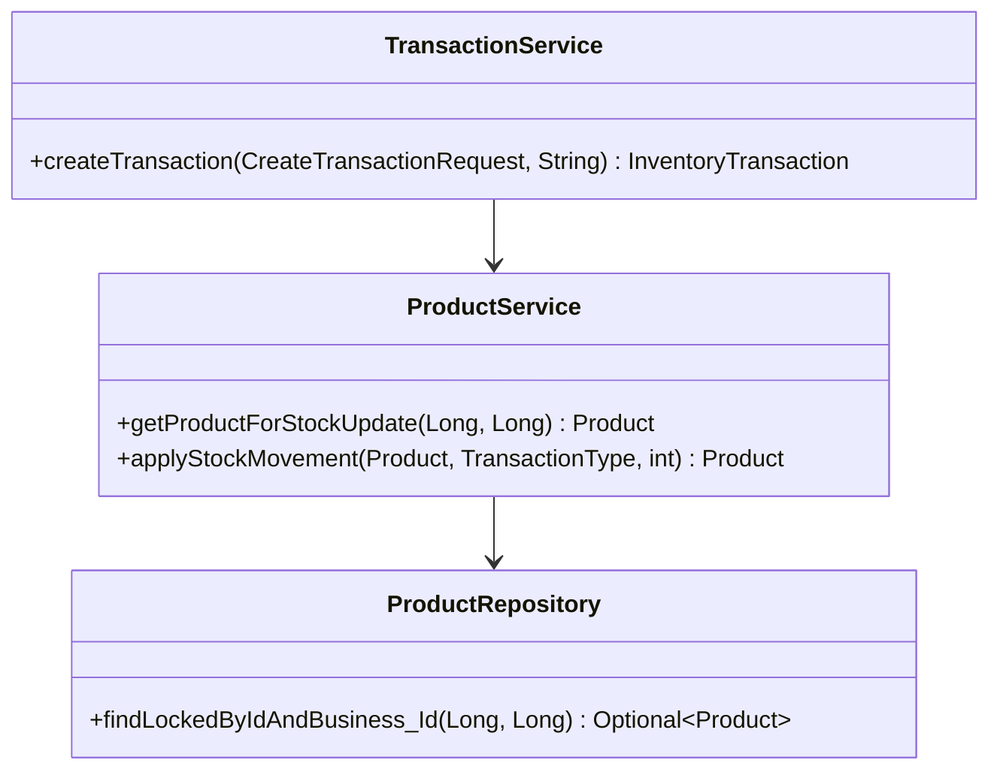

# King Sparkon Tracker Backend

Spring Boot backend for King Sparkon Tracker: barcode stock control, business tenants, owner and worker access, inventory transactions, reports, billing, tips, payouts, and audit logs.

This repository is hardened for Google Cloud Run, PostgreSQL, Redis-backed rate limiting, Stripe website payments, PayPal billing and payouts, Flyway migrations, Actuator metrics, Prometheus, and Grafana.

## Production Hardening Added

| Area | Result |
| --- | --- |
| Refresh-token flow | Added refresh token entity, repository, rotation service, login response fields, refresh endpoint, logout endpoint, and password-reset revocation. |
| Error codes | Added stable machine-readable error codes through `ErrorCode` and the API exception handler. |
| Database | Added Flyway migration for refresh token persistence. |
| Cloud Run | Added Dockerfile. |
| CI | Added GitHub Actions Maven verify and Docker build workflow. |
| Observability | Added Actuator, Prometheus registry dependency, and Grafana dashboard JSON. |
| Startup safety | Added production startup configuration validator. |
| Tests | Added focused tests for production config, stock locking, and webhook idempotency mapping. |
| Tip fee | Confirmed worker tip withdrawal fee is 8.5%. |

## System Architecture



## Core Flow



## ERD



## Use Cases



## UML: Refresh Token Flow



## UML: Stock Movement



## Stable Error Contract

All API failures should expose a stable `code` field so the Next.js UI can show exact states.

Example:

```json
{
  "timestamp": "2026-06-24T10:15:30",
  "status": 400,
  "error": "Bad Request",
  "code": "VALIDATION_FAILED",
  "message": "Transaction must contain at least one item",
  "path": "/api/transactions",
  "requestId": "request-id-from-logs"
}
```

Important codes include `VALIDATION_FAILED`, `AUTHENTICATION_FAILED`, `EMAIL_NOT_VERIFIED`, `RESOURCE_NOT_FOUND`, `DUPLICATE_BARCODE`, `INSUFFICIENT_STOCK`, `RATE_LIMIT_EXCEEDED`, `PAYMENT_FAILED`, `WEBHOOK_SIGNATURE_INVALID`, `WEBHOOK_DUPLICATE`, and `BUSINESS_ACCESS_RESTRICTED`.

## Running Locally

```bash
./mvnw spring-boot:run
```

## Running Tests and Coverage

```bash
./mvnw -B clean verify
```

Coverage output:

```text
target/site/jacoco/index.html
target/site/jacoco/jacoco.xml
```

Minimum production test gates:

| Area | Required tests |
| --- | --- |
| Auth | Login, refresh rotation, logout, password reset revokes refresh tokens. |
| Authorization | Owner-only endpoints reject worker and affiliate roles. |
| Tenant isolation | Users cannot read or mutate another business's resources. |
| Stock | Concurrent SELL attempts cannot oversell locked product rows. |
| Barcodes | Duplicate barcode rejected and sold barcode cannot be reused. |
| Stripe | Signature failure rejected, duplicate event skipped, success event marks payment paid once. |
| PayPal | Verified webhook, duplicate event skipped, billing state transitions. |
| Tips | 8.5% fee, 7-day hold, R1000 minimum, owner-only withdrawal. |
| Rate limiting | Public auth limit and tenant-plan limits. |
| Config | Production profile fails startup when required configuration is missing. |

## Cloud Run

Build:

```bash
docker build -t king-sparkon-tracker-backend .
```

Deploy:

```bash
gcloud run deploy king-sparkon-tracker-backend \
  --image REGION-docker.pkg.dev/PROJECT/king-sparkon/backend:TAG \
  --region REGION \
  --platform managed \
  --allow-unauthenticated \
  --port 8080 \
  --set-env-vars SPRING_PROFILES_ACTIVE=prod
```

## Observability

Grafana dashboard:

```text
ops/grafana/king-sparkon-cloud-run-dashboard.json
```

Recommended panels: HTTP request volume, 5xx rate, P95 latency, JVM memory, CPU, database connections, and 429 responses.

## Business Rules Worth Protecting

- Every business resource must be scoped to the authenticated business.
- Product barcodes must be unique.
- Product stock cannot go below zero.
- SELL transactions require scanned barcodes.
- Website payments are only marked paid by verified webhooks.
- Webhook event ids must be processed idempotently.
- Tip withdrawal fee is 8.5%.
- Sensitive actions must be written to audit logs.
