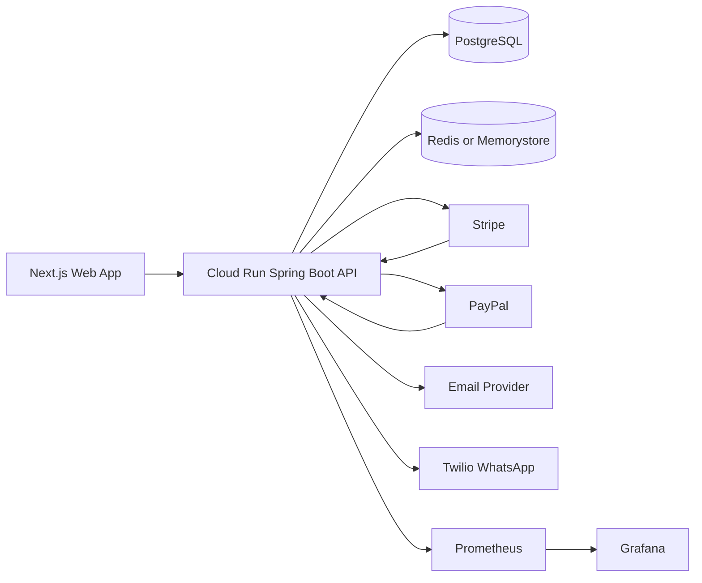
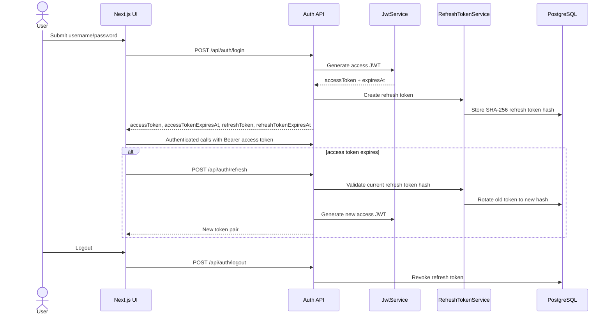
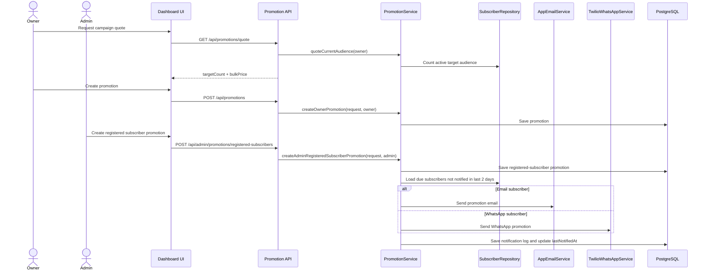
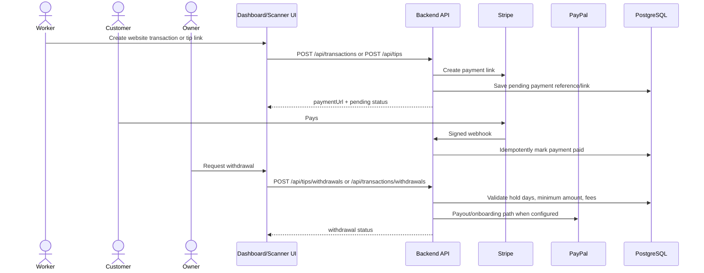
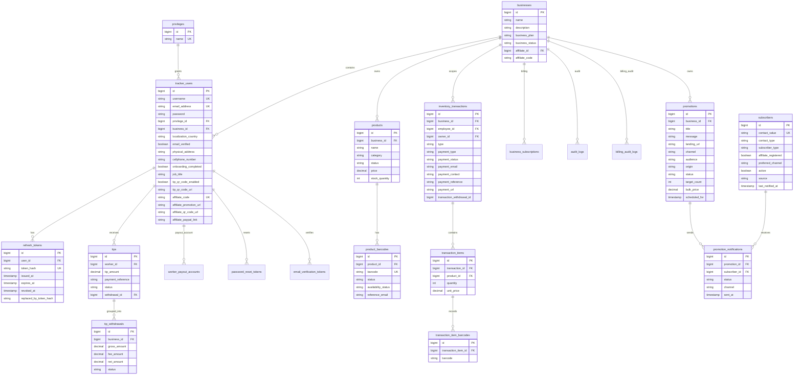

# King Sparkon Tracker Backend

Spring Boot backend for King Sparkon Tracker: barcode stock control, business tenants, owner and worker access, inventory transactions, reports, billing, tips, payouts, subscribers, promotions, affiliate programs, and audit logs.

This repository is hardened for Google Cloud Run, PostgreSQL, Redis caching, Redis-backed or memory-backed rate limiting, JWT access tokens, refresh-token sessions, Stripe website payments, PayPal billing and payouts, Flyway migrations, Actuator metrics, Prometheus, and Grafana.

Full backend/frontend system contract: [`docs/backend-system-design.md`](docs/backend-system-design.md)

## Production Hardening Added

| Area | Result |
| --- | --- |
| Refresh-token flow | Added refresh token entity, repository, rotation service, login response fields, refresh endpoint, logout endpoint, and password-reset revocation. |
| JWT session policy | Access tokens expire after `app.jwt.expiration-minutes`, default 120 minutes. Refresh tokens expire after `app.refresh-token.expiration-days`, default 30 days. |
| Rate limiting | Public auth/contact endpoints and authenticated business endpoints are rate-limited by IP/path or business plan. |
| Error codes | Added stable machine-readable error codes through `ErrorCode` and the API exception handler. |
| Database | Added Flyway migrations and `ddl-auto=validate`. |
| Cloud Run | Added Dockerfile. |
| Build gate | Docker build runs full Maven verification through `scripts/full-maven-scan.sh`. |
| Observability | Added Actuator, Prometheus registry dependency, and Grafana dashboard JSON. |
| Startup safety | Added production startup configuration validator. |
| Redis | Added Redis-backed Spring Cache for roles, billing policy, feature access, and promotion quote data. |
| Tests | Added focused positive/negative tests for production config, authorization, stock locking, webhook idempotency, owner business description, payment contact capture, and caching policy. |
| Tip fee | Worker tip withdrawal fee remains the configured `app.tips.withdrawal-fee-percent`; the removed 2.03% addition is not part of production logic. |

## System Architecture



## Core Flow

```mermaid
sequenceDiagram
    actor Owner
    actor Worker
    actor Customer
    participant API as Backend API
    participant DB as PostgreSQL
    participant Redis
    participant Stripe

    Owner->>API: Register business + description
    API->>DB: Create tenant and owner
    API->>DB: Persist business description
    Worker->>API: Login
    API-->>Worker: Access token and refresh token
    Owner->>API: Create product
    Worker->>API: Assign barcodes
    Customer->>Worker: Buys product
    Worker->>API: Create SELL transaction
    API->>DB: Lock product row
    API->>DB: Reduce stock and mark barcodes sold
    alt Website payment
        API->>Stripe: Create payment link
        API->>DB: Persist paymentContact
        API->>DB: Subscribe paymentContact as CLIENT
        Stripe->>API: Signed webhook
        API->>DB: Mark payment paid once
    else Cash or swipe
        API->>DB: Save offline payment state
    end
    API->>Redis: Cache safe policy/reference data
```



## Full System UML

### Backend component UML

```mermaid
classDiagram
    class AuthenticationController {
      +register(RegisterUserRequest) UserResponse
      +registerAdministrator(RegisterAdministratorRequest) UserResponse
      +registerAffiliate(RegisterAffiliateRequest) UserResponse
      +login(LoginRequest) AuthResponse
      +refresh(RefreshTokenRequest) AuthResponse
      +logout(RefreshTokenRequest) MessageResponse
    }

    class TrackerUserService {
      +registerOwner(RegisterUserRequest) TrackerUser
      +registerAdministrator(RegisterAdministratorRequest) TrackerUser
      +registerAffiliate(RegisterAffiliateRequest) TrackerUser
      +createWorker(CreateWorkerRequest, String) TrackerUser
      +authenticate(LoginRequest) TrackerUser
      +completeOnboarding(CompleteOnboardingRequest, String) TrackerUser
    }

    class RefreshTokenService {
      +issueTokenPair(TrackerUser, String, String) TokenPair
      +rotate(String, String, String) TokenPair
      +revoke(String) void
      +revokeAllForUser(Long) void
    }

    class JwtService {
      +generateToken(TrackerUser) TokenResult
    }

    class ProductService {
      +createProduct(CreateProductRequest, String) Product
      +getProductForStockUpdate(Long, Long) Product
      +applyStockMovement(Product, TransactionType, int) Product
    }

    class TransactionService {
      +createTransaction(CreateTransactionRequest, String) InventoryTransaction
      +listTransactions(Pageable, String) Page~InventoryTransaction~
      +getTransactionById(Long, String) InventoryTransaction
    }

    class TipService {
      +createTip(TipRequest) TipResponse
      +listTips(String) Page~Tip~
    }

    class TipWithdrawalService {
      +requestWithdrawal(String) TipWithdrawalResponse
      +markTipPaid(Long, String) TipResponse
    }

    class SubscriberService {
      +subscribe(SubscribeRequest) SubscriberResponse
      +unsubscribe(String) void
      +subscribeTipPaymentClient(String) void
      +subscribeWebsitePaymentClient(String) void
    }

    class PromotionService {
      +quoteCurrentAudience(String) PromotionPriceQuoteResponse
      +createOwnerPromotion(CreatePromotionRequest, String) PromotionResponse
      +createAdminRegisteredSubscriberPromotion(CreatePromotionRequest, String) PromotionResponse
      +processDuePromotions() void
    }

    class BusinessPlanPolicyService {
      +monthlyPrice(BusinessPlan) BigDecimal
      +maxWorkers(BusinessPlan) int
      +isFeatureEnabled(Business, BusinessFeature) boolean
      +billingPlans() List~BillingPlanResponse~
    }

    class BusinessAccessService {
      +businessForActor(String) Business
      +requireActiveBusiness(String) void
      +requireFeature(String, BusinessFeature) void
    }

    class RateLimitService {
      +checkPublicAuth(String) RateLimitDecision
      +checkBusiness(String, BusinessPlan) RateLimitDecision
    }

    class StripeService
    class PayPalService
    class TwilioWhatsAppService
    class AppEmailService
    class RedisCacheConfig

    AuthenticationController --> TrackerUserService
    AuthenticationController --> RefreshTokenService
    RefreshTokenService --> JwtService
    TransactionService --> ProductService
    TransactionService --> StripeService
    TransactionService --> AppEmailService
    TransactionService --> SubscriberService
    TipService --> StripeService
    TipService --> SubscriberService
    PromotionService --> SubscriberService
    PromotionService --> AppEmailService
    PromotionService --> TwilioWhatsAppService
    BusinessAccessService --> BusinessPlanPolicyService
    RateLimitService --> RedisCacheConfig
```



### Security/session UML



### Promotion and subscriber UML



### Payment, tips, and withdrawal UML



## Full System Use Cases

```mermaid
flowchart TB
    Public((Public visitor))
    Owner((Owner))
    Worker((Worker))
    Affiliate((Affiliate))
    Admin((Admin))
    Customer((Customer))
    Stripe((Stripe))
    PayPal((PayPal))
    Twilio((Twilio WhatsApp))

    Public --> RegisterOwner[Register owner account]
    Public --> RegisterAffiliate[Register affiliate]
    Public --> Subscribe[Subscribe or unsubscribe]
    Public --> Login[Login]
    Public --> ResetPassword[Forgot/reset password]
    Public --> VerifyEmail[Verify email]

    Owner --> CompleteOnboarding[Complete business onboarding]
    Owner --> ManageWorkers[Create/list/delete workers]
    Owner --> ManageProducts[Create/update products]
    Owner --> ManageBarcodes[Add/scan barcodes]
    Owner --> ViewReports[View reports and audit logs]
    Owner --> CreatePromotion[Create owner promotion]
    Owner --> QuotePromotion[Quote bulk promotion cost]
    Owner --> ManageTips[Manage tips and paid status]
    Owner --> WithdrawTips[Request tip withdrawal]
    Owner --> WithdrawTransactions[Request website-payment withdrawal]
    Owner --> ManageBilling[Manage plan and billing]

    Worker --> ScanBarcode[Scan barcode]
    Worker --> CreateBuySell[Create BUY/SELL transaction]
    Worker --> CreateTip[Create tip payment link/QR]

    Affiliate --> ViewAffiliateLink[View affiliate code/link/QR]
    Affiliate --> CompleteAffiliateOnboarding[Complete affiliate onboarding]
    Affiliate --> PromoteTracker[Promote King Sparkon Tracker]

    Admin --> ViewPlatform[View platform users/businesses]
    Admin --> CreateRegisteredPromotion[Create registered-subscriber promotion]

    Customer --> PayWebsitePayment[Pay website transaction]
    Customer --> PayTip[Pay worker tip]

    Stripe --> StripeWebhook[Send signed webhook]
    PayPal --> PayPalWebhook[Send verified webhook]
    Twilio --> WhatsAppDelivery[Deliver WhatsApp promotion]
```



## Full ERD



## UI-Ready System Design Contract

The frontend should be designed around these screens, roles, endpoints, business rules, rate limits, and session expiry rules.

### Roles and UI Areas

| Role | UI area | Main capabilities |
| --- | --- | --- |
| `Owner` | Owner dashboard | Business onboarding, workers, products, barcodes, transactions, promotions, tips, withdrawals, billing, reports, audit logs. |
| `Worker` | Worker scanner/mobile dashboard | Scan barcodes, create transactions, create tip payment links/QR codes. |
| `Affiliate` | Affiliate dashboard | Promote King Sparkon Tracker, view promotion code/QR/link, complete affiliate onboarding. |
| `Admin` | Admin dashboard | Oversee businesses/users and create registered-subscriber platform promotions. |
| Public user | Public website | Subscribe, unsubscribe, register, verify email, request password reset, open affiliate links. |

### Public API for UI

| Screen | Method | Endpoint | Auth |
| --- | --- | --- | --- |
| Owner registration | `POST` | `/api/auth/register` | Public |
| Admin registration | `POST` | `/api/auth/register-admin` | Public, but email must end with `@kingsparkon.com` |
| Affiliate registration | `POST` | `/api/auth/register-affiliate` | Public |
| Login | `POST` | `/api/auth/login` | Public |
| Refresh session | `POST` | `/api/auth/refresh` | Public with refresh token |
| Logout | `POST` | `/api/auth/logout` | Auth/session token |
| Forgot password | `POST` | `/api/auth/forgot-password` | Public |
| Reset password | `POST` | `/api/auth/reset-password` | Public |
| Verify email | `GET` | `/api/auth/verify-email?token=...` | Public |
| Subscribe | `POST` | `/api/subscribers` | Public |
| Unsubscribe | `DELETE` | `/api/subscribers?contact=...` | Public |
| Contact form | `POST` | `/api/contact-inquiries` | Public |

## JWT Session Time and Token Rules

| Token/session item | Property | Default | UI behavior |
| --- | --- | ---: | --- |
| Access JWT | `app.jwt.expiration-minutes` / `JWT_EXPIRATION_MINUTES` | 120 minutes | Store in memory or secure client storage. Attach as `Authorization: Bearer <token>`. Refresh before/after expiry. |
| Refresh token | `app.refresh-token.expiration-days` | 30 days | Store securely. Use `/api/auth/refresh` to rotate session. Clear on logout. |
| Password reset token | `app.password-reset.expiration-minutes` / `PASSWORD_RESET_EXPIRATION_MINUTES` | 30 minutes | Show expired-link state and allow user to request a new link. |
| Email verification token | verification endpoint | token-based | Show success/failure message from `/api/auth/verify-email`. |

JWT business rules:

- Access tokens contain `userId`, `emailAddress`, `businessId`, `businessName`, and `roles` claims.
- Owners, affiliates, and admins must verify email before login.
- Refresh tokens are stored hashed in PostgreSQL, not as raw values.
- Refresh rotates the refresh token: the old token is replaced and should not be reused.
- Logout revokes the refresh token.
- Password reset revokes active refresh tokens for that user.

Frontend session rules:

- If API returns `401`, attempt refresh once when a refresh token exists.
- If refresh fails, clear session and redirect to login.
- If API returns `403 EMAIL_NOT_VERIFIED`, show verification-required UI.
- If refresh succeeds, replace both access token and refresh token in client session state.

## Rate Limiting Rules

Rate limiting protects public auth/contact endpoints and authenticated business API usage.

### Rate-limit backend

| Property | Default | Meaning |
| --- | --- | --- |
| `app.rate-limit.enabled` / `RATE_LIMIT_ENABLED` | `true` | Enables or disables rate limiting. |
| `RATE_LIMIT_BACKEND` / `app.rate-limit.backend` | `memory` | Use `memory` locally or `redis` for multi-instance Cloud Run. |

### Public auth/contact rate limits

Public auth/contact paths are keyed by client IP + HTTP method + path.

| Policy | Limit | Window | Retry-after | Typical paths |
| --- | ---: | ---: | ---: | --- |
| `PUBLIC_AUTH` | 10 requests | 60 seconds | 60 seconds | register, login, forgot/reset password, resend verification, verify email, contact inquiry |

### Business plan rate limits

Authenticated business calls are keyed by business id and plan.

| Plan/policy | Limit | Window | Retry-after |
| --- | ---: | ---: | ---: |
| `FREE_TRIAL` | 30 requests | 60 seconds | 30 seconds |
| `PLUS` | 120 requests | 60 seconds | 15 seconds |
| `PRO` | 600 requests | 60 seconds | 5 seconds |

### Rate-limit response contract

When the limit is exceeded, the API returns HTTP `429` with a JSON body:

```json
{
  "timestamp": "2026-06-24T10:15:30Z",
  "status": 429,
  "error": "RATE_LIMIT_EXCEEDED",
  "message": "Rate limit reached for PUBLIC_AUTH. Please wait 60 seconds before retrying.",
  "policy": "PUBLIC_AUTH",
  "retryAfterSeconds": 60,
  "limit": 10,
  "remaining": 0
}
```

Rate-limit headers:

| Header | Meaning |
| --- | --- |
| `X-RateLimit-Policy` | Active policy label such as `PUBLIC_AUTH`, `FREE_TRIAL`, `PLUS`, or `PRO`. |
| `X-RateLimit-Limit` | Max allowed requests in the window. |
| `X-RateLimit-Remaining` | Remaining requests in the current window. |
| `X-RateLimit-Reset` | Seconds until current rate-limit window resets. |
| `Retry-After` | Present when request is blocked. |

Frontend behavior:

- Disable repeated login/reset/verification submissions while a request is in flight.
- On `429`, show a cooldown timer using `retryAfterSeconds` or `Retry-After`.
- Do not automatically retry write requests until cooldown expires.
- Admin/owner dashboards should show a non-blocking toast for rate-limit errors.

## Owner Registration UI Payload

```json
{
  "username": "owner",
  "emailAddress": "owner@example.com",
  "password": "secret",
  "businessName": "Spark Store",
  "businessDescription": "Barcode-enabled retail store selling beverages and convenience products.",
  "localizationCountry": "SOUTH_AFRICA",
  "physicalAddress": "12 Main Road, Johannesburg",
  "cellphoneNumber": "+27821234567",
  "affiliateCode": "AFF-ALICE-1234"
}
```

Business rules for UI:

- `businessName` is required.
- `businessDescription` is optional but should be shown on the onboarding screen; max 2000 characters.
- If `physicalAddress` and `cellphoneNumber` are provided, onboarding can be marked complete.
- After registration, the UI must show an email-verification pending state.
- If `affiliateCode` is present, the backend links the business to the affiliate.

### Business Feature Rules for UI

Frontend may show locked/upgrade states, but backend is the source of truth.

| Feature | Free Trial | Plus | Pro |
| --- | --- | --- | --- |
| `CREATE_WORKERS` | Yes, max 2 workers | Yes, max 5 workers | Yes, unlimited workers |
| `CREATE_PRODUCTS` | Yes | Yes | Yes |
| `ADD_BARCODES` | Yes | Yes | Yes |
| `SCAN_BARCODES` | Yes | Yes | Yes |
| `WORKER_TIPS_PLATFORM` | Locked | Locked | Enabled |
| `BUSINESS_ANALYSIS_AI` | Locked | Locked | Enabled |
| `WORKER_CLOCKER` | Locked | Locked | Enabled |

Business status rules:

- `TRIAL` and `ACTIVE` businesses can use allowed features.
- `DEACTIVATED` businesses should show an activation/subscription-required state.
- If a feature is locked, show upgrade CTA to Pro where relevant.

### Transaction / Website Payment UI Payload

```json
{
  "type": "SELL",
  "paymentType": "WEBSITE_PAYMENT",
  "paymentEmail": "customer@example.com",
  "paymentContact": "+27821234567",
  "employeeId": 2,
  "ownerId": 1,
  "items": [
    {
      "productId": 10,
      "quantity": 1,
      "barcodes": ["6001234567890"]
    }
  ]
}
```

Business rules for UI:

- `paymentEmail` remains backward-compatible for Stripe email/payment delivery.
- `paymentContact` can be an email or cellphone.
- `paymentContact` is persisted on the transaction response.
- `paymentContact` is auto-subscribed only when `paymentType = WEBSITE_PAYMENT`.
- `CASH` and `SWIPE_MACHINE` must not auto-subscribe the customer.
- UI should display `paymentUrl`, `paymentStatus`, `paymentReference`, `paymentEmail`, and `paymentContact` in transaction details.

### Subscriber UI Payloads

King Sparkon subscriber:

```json
{
  "contact": "client@example.com",
  "subscriberType": "KINGSPARKON_SUBSCRIBER",
  "preferredChannel": "EMAIL"
}
```

Unregistered affiliate lead:

```json
{
  "contact": "+27821234567",
  "subscriberType": "AFFILIATE",
  "affiliateRegistered": false,
  "preferredChannel": "WHATSAPP"
}
```

Registered affiliate subscriber:

```json
{
  "contact": "affiliate@example.com",
  "subscriberType": "AFFILIATE",
  "affiliateRegistered": true,
  "preferredChannel": "EMAIL"
}
```

Subscriber rules:

- Contact can be email or cellphone.
- Emails are normalized lowercase.
- Cellphones must be international format, for example `+27821234567`.
- Tip payment-link clients and website-payment clients become `CLIENT` subscribers.
- Existing inactive subscribers are reactivated.

### Promotions UI Contract

| Screen | Method | Endpoint | Role |
| --- | --- | --- | --- |
| Promotion quote | `GET` | `/api/promotions/quote` | Owner |
| Create owner promotion | `POST` | `/api/promotions` | Owner |
| List owner promotions | `GET` | `/api/promotions` | Owner |
| Admin registered-subscriber promotion | `POST` | `/api/admin/promotions/registered-subscribers` | Admin |

Promotion audience values:

- `ALL_SUBSCRIBERS`
- `REGISTERED_AFFILIATES`
- `UNREGISTERED_AFFILIATES`
- `REGISTERED_SUBSCRIBERS`

Promotion channel values:

- `EMAIL`
- `WHATSAPP`
- `ANY`

Promotion pricing rules:

| Audience size | Platform fee | Subscriber rate |
| --- | ---: | ---: |
| 1-100 | R49 | R0.90 |
| 101-1000 | R49 | R0.65 |
| 1001+ | R49 | R0.45 |

Promotion anti-crowding rule:

- A subscriber must not receive more than one promotion inside a 2-day window.
- UI should not promise immediate delivery to every subscriber; show campaign status and processed counts.

### Tips UI Contract

Tip payment link payload:

```json
{
  "workerId": 12,
  "tipAmount": 50.00,
  "callbackUrl": "https://app.example/tips/complete",
  "clientContact": "client@example.com"
}
```

Rules:

- Worker creates a tip link/QR.
- `clientContact` subscribes the client by default.
- Tip withdrawal uses configured fee only; no extra 2.03% fee.
- Owner manages withdrawal flow from dashboard.

### Redis Caching Design

Redis caching is enabled through Spring Cache and the `redis` profile.

```bash
SPRING_PROFILES_ACTIVE=redis
```

| Cache | TTL | Purpose |
| --- | ---: | --- |
| `privileges` | 12h | Role list for admin/settings/UI. |
| `privilegeByRole` | 12h | Role lookup during auth/user creation. |
| `billingPlans` | 6h | Public pricing plan cards. |
| `affiliateCommissionTiers` | 6h | Affiliate commission UI. |
| `businessPlanPrices` | 6h | Business plan pricing. |
| `businessPlanWorkerLimits` | 6h | Worker limits per plan. |
| `businessFeatureAccess` | 15m | Feature-policy access keyed by business id, plan, status, and feature. |
| `promotionQuotes` | 10m | Bulk promotion quote pricing. |

Caching rules:

- Do not cache whole `Business` or `TrackerUser` entities for authorization.
- Feature access is cached using business id + plan + status + feature, so upgrades/downgrades naturally use a new key.
- Billing plans and static policy data can be cached longer.
- Promotion quotes use short TTL because audience size changes.

Run Redis locally:

```bash
docker compose -f docker-compose.redis.yml up -d
```

Run backend with Redis locally:

```bash
SPRING_PROFILES_ACTIVE=redis REDIS_HOST=localhost ./mvnw spring-boot:run
```

## Stable Error Contract

All API failures should expose a stable `code` field so the Next.js UI can show exact states.

Example:

```json
{
  "timestamp": "2026-06-24T10:15:30",
  "status": 400,
  "error": "Bad Request",
  "code": "VALIDATION_FAILED",
  "message": "Transaction must contain at least one item",
  "path": "/api/transactions",
  "requestId": "request-id-from-logs"
}
```

Important codes include `VALIDATION_FAILED`, `AUTHENTICATION_FAILED`, `EMAIL_NOT_VERIFIED`, `RESOURCE_NOT_FOUND`, `DUPLICATE_BARCODE`, `INSUFFICIENT_STOCK`, `RATE_LIMIT_EXCEEDED`, `PAYMENT_FAILED`, `WEBHOOK_SIGNATURE_INVALID`, `WEBHOOK_DUPLICATE`, and `BUSINESS_ACCESS_RESTRICTED`.

## Running Locally

```bash
./mvnw spring-boot:run
```

With Redis:

```bash
docker compose -f docker-compose.redis.yml up -d
SPRING_PROFILES_ACTIVE=redis REDIS_HOST=localhost ./mvnw spring-boot:run
```

## Running Tests and Coverage

```bash
./scripts/full-maven-scan.sh
```

Equivalent Maven command:

```bash
./mvnw -B clean verify
```

Coverage output:

```text
target/site/jacoco/index.html
target/site/jacoco/jacoco.xml
```

Minimum production test gates:

| Area | Required tests |
| --- | --- |
| Auth | Login, refresh rotation, logout, password reset revokes refresh tokens. |
| Authorization | Owner-only endpoints reject worker and affiliate roles. |
| Tenant isolation | Users cannot read or mutate another business's resources. |
| Stock | Concurrent SELL attempts cannot oversell locked product rows. |
| Barcodes | Duplicate barcode rejected and sold barcode cannot be reused. |
| Stripe | Signature failure rejected, duplicate event skipped, success event marks payment paid once. |
| PayPal | Verified webhook, duplicate event skipped, billing state transitions. |
| Tips | Configured fee, 7-day hold, R1000 minimum, owner-only withdrawal. |
| Subscribers | Email/cellphone positive paths, invalid phone/email negative paths, unsubscribe/reactivation. |
| Promotions | Audience targeting, 2-day anti-crowding, email/WhatsApp channel handling. |
| Redis cache | Cache names, TTLs, feature-policy key safety. |
| Rate limiting | Public auth limit, business plan limits, headers, and 429 body. |
| JWT/session | Access expiry, refresh rotation, logout revocation, password-reset revocation. |
| Config | Production profile fails startup when required configuration is missing. |

## Cloud Run

Build:

```bash
docker build -t king-sparkon-tracker-backend .
```

Deploy:

```bash
gcloud run deploy king-sparkon-tracker-backend \
  --image REGION-docker.pkg.dev/PROJECT/king-sparkon/backend:TAG \
  --region REGION \
  --platform managed \
  --allow-unauthenticated \
  --port 8080 \
  --set-env-vars SPRING_PROFILES_ACTIVE=prod
```

Production secrets must be stored in Google Secret Manager or Cloud Run environment variables. Do not commit credentials.

## Observability

Grafana dashboard:

```text
ops/grafana/king-sparkon-cloud-run-dashboard.json
```

Recommended panels: HTTP request volume, 5xx rate, P95 latency, JVM memory, CPU, database connections, Redis latency/errors, promotion send failures, webhook failures, rate-limit 429 responses, JWT refresh failures, and webhook duplicate counts.

## Business Rules Worth Protecting

- Every business resource must be scoped to the authenticated business.
- Owner promotions are owner-only.
- Admin APIs are admin-only.
- Subscriber signup/unsubscribe is public.
- Public auth/contact endpoints are rate-limited by IP + method + path.
- Authenticated business endpoints are rate-limited by business id and plan.
- Access JWTs expire according to `app.jwt.expiration-minutes`.
- Refresh tokens must rotate and old refresh tokens must not be reused.
- Product barcodes must be unique.
- Product stock cannot go below zero.
- SELL transactions require scanned barcodes.
- Website payments are only marked paid by verified webhooks.
- Website-payment contacts are persisted and subscribed only for website payments.
- CASH and SWIPE payments must not auto-subscribe customers.
- Webhook event ids must be processed idempotently.
- Tip withdrawal uses the configured fee only.
- Promotion sends must respect the 2-day anti-crowding rule.
- Sensitive actions must be written to audit logs.
