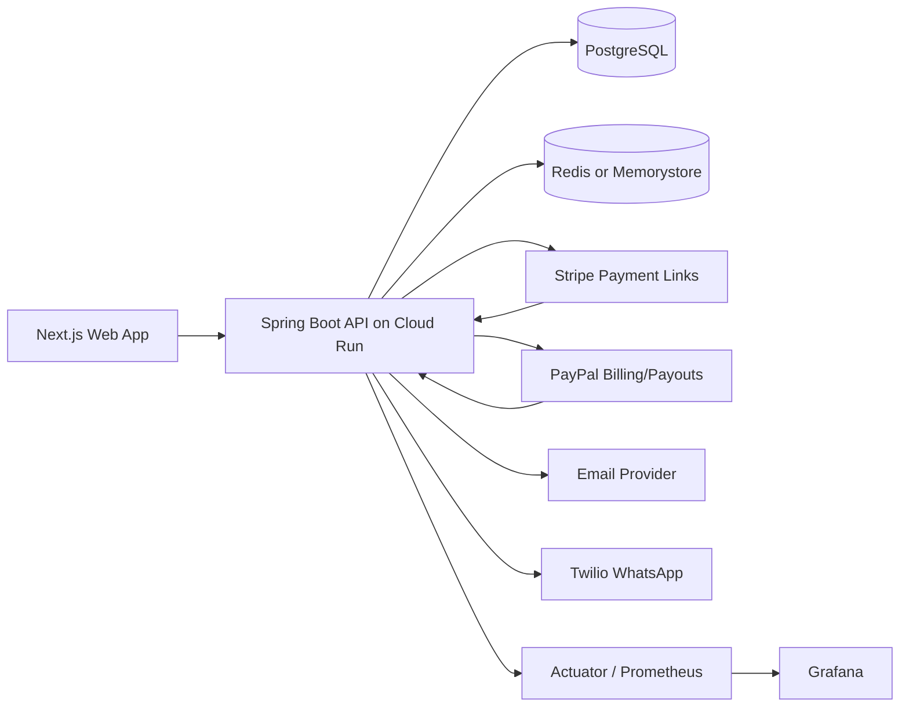
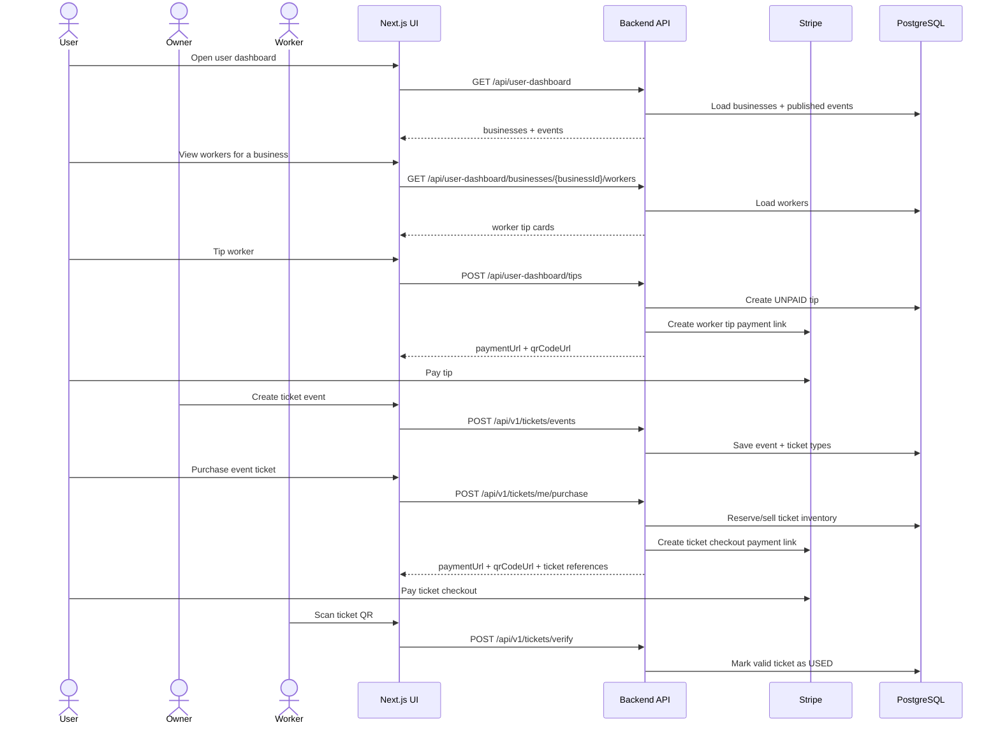
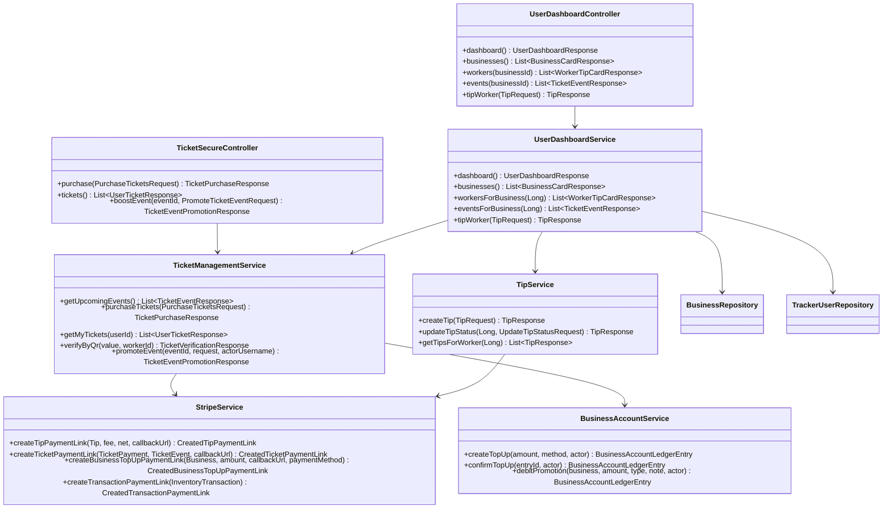
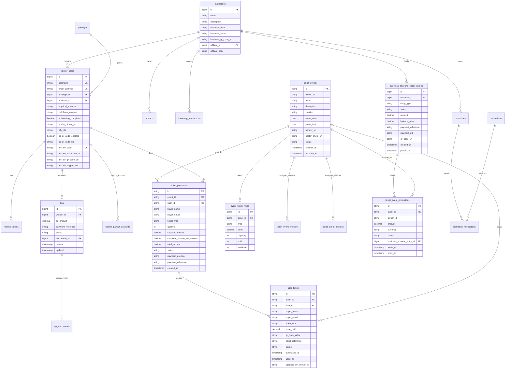

# King Sparkon Tracker Backend

Spring Boot backend for King Sparkon Tracker: barcode inventory, business tenants, workers, affiliates, tickets, tips, Stripe payments, business account top-ups, promotions, payouts, reports, audit logs, and user dashboards.

This backend is designed for Google Cloud Run with PostgreSQL, Flyway, JWT sessions, Redis-compatible caching/rate limiting, Stripe payment links, PayPal billing/payout support, email, WhatsApp notifications, Actuator metrics, Prometheus, Grafana, and Docker CI.

> Payment note: this system uses Stripe-backed payment links for tips, ticket checkout, business account top-ups, and website transactions. Google Pay placeholders were removed because Google Pay is not part of the current implementation scope.

## Key Features Added

| Area | Capability |
| --- | --- |
| User dashboard | Users can view businesses, business workers for tips, published business events, and a combined dashboard feed. |
| Worker tips | Users can create worker tip payments and receive a Stripe payment URL plus QR code. |
| Ticket events | Users can view ticket events by business and purchase event tickets through Stripe checkout links. |
| Ticket QR | Purchased tickets generate ticket references and QR payloads for worker verification. |
| Business account | Owners can top up an in-app business account and use that balance for owner promotions and ticket event boosts. |
| Posters and profiles | Ticket events support poster photo URLs; workers, users, and affiliates support profile-picture fields. Google Cloud image hosting is planned separately. |
| Affiliates | Affiliate onboarding supports payout/profile data and affiliate referral QR/link fields. |
| CI hardening | Docker CI runs Maven verification through the backend build gate. |
| Tests | Focused unit tests cover ticket business rules, onboarding profile data, business account debit rules, and user dashboard/tip flows. |

## System Architecture



## User Dashboard and Payments Flow



## Component UML



## Full ERD



## API Contract for UI

### User dashboard

| Method | Endpoint | Purpose |
| --- | --- | --- |
| `GET` | `/api/user-dashboard` | View businesses and upcoming events. |
| `GET` | `/api/user-dashboard/businesses` | View business cards. |
| `GET` | `/api/user-dashboard/businesses/{businessId}/workers` | View workers available for tips. |
| `GET` | `/api/user-dashboard/businesses/{businessId}/events` | View published events for that business. |
| `POST` | `/api/user-dashboard/tips` | Create a worker tip Stripe payment link. |

### Tickets

| Method | Endpoint | Purpose |
| --- | --- | --- |
| `GET` | `/api/v1/tickets/events` | Public/upcoming ticket events. |
| `POST` | `/api/v1/tickets/me/purchase` | Create ticket checkout and return Stripe payment URL/QR. |
| `GET` | `/api/v1/tickets/me/tickets` | View my purchased tickets. |
| `POST` | `/api/v1/tickets/me/events/{eventId}/boosts` | Owner boosts a ticket event using business-account balance. |
| `GET` | `/api/v1/tickets/me/event-boosts` | Owner views event boosts. |

### Business account

| Method | Endpoint | Purpose |
| --- | --- | --- |
| `GET` | `/api/business-account/summary` | View owner account balance. |
| `GET` | `/api/business-account/ledger` | View ledger movements. |
| `POST` | `/api/business-account/top-ups` | Create Stripe top-up link. |
| `POST` | `/api/business-account/top-ups/{entryId}/confirm` | Confirm completed top-up. |

## Configuration

Required production secrets must be supplied by environment variables or a secret manager. Do not commit real values.

```properties
STRIPE_SECRET_KEY=
STRIPE_WEBHOOK_SECRET=
BUSINESS_ACCOUNT_TOP_UP_SUCCESS_URL=https://your-ui/dashboard/owner/account?topup=success
BUSINESS_ACCOUNT_TOP_UP_CANCEL_URL=https://your-ui/dashboard/owner/account?topup=cancelled
TICKETS_CHECKOUT_SUCCESS_URL=https://your-ui/tickets/my-tickets?stripe=success
TICKETS_CHECKOUT_CANCEL_URL=https://your-ui/tickets?stripe=cancelled
TICKETS_WITHDRAWAL_FEE_PERCENT=5.00
TICKETS_WITHDRAWAL_MINIMUM_ZAR=100.00
TICKETS_PROMOTION_PRICE_ZAR=1500.00
```

## Testing and CI

Run locally:

```bash
mvn test
```

Docker CI path:

```bash
bash scripts/full-maven-scan.sh
```

CI builds the backend Docker image and runs Maven verification. Current focused tests include:

- `TicketBusinessRulesTest`
- `BusinessAccountServiceTest`
- `OnboardingProfileServiceTest`
- `UserDashboardServiceTest`

## Deployment Notes

- Use Google Cloud Run for the Spring Boot container.
- Use Cloud SQL PostgreSQL or managed PostgreSQL.
- Use Secret Manager for Stripe, PayPal, SMTP, JWT, and DB credentials.
- Use Redis or Memorystore for distributed cache/rate limiting when running multiple instances.
- Use Actuator + Prometheus + Grafana for observability.
